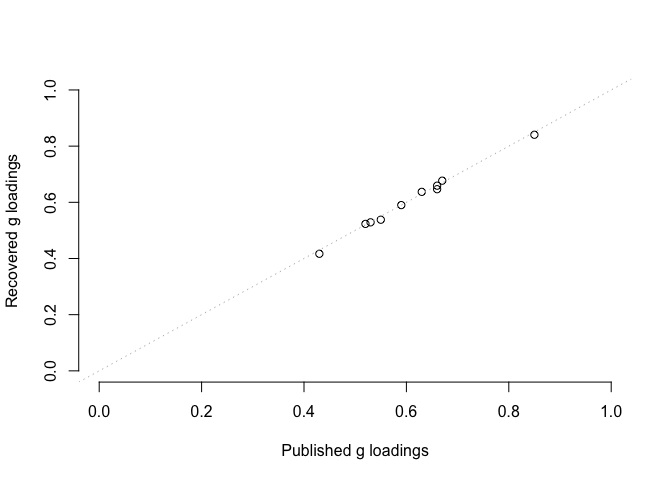
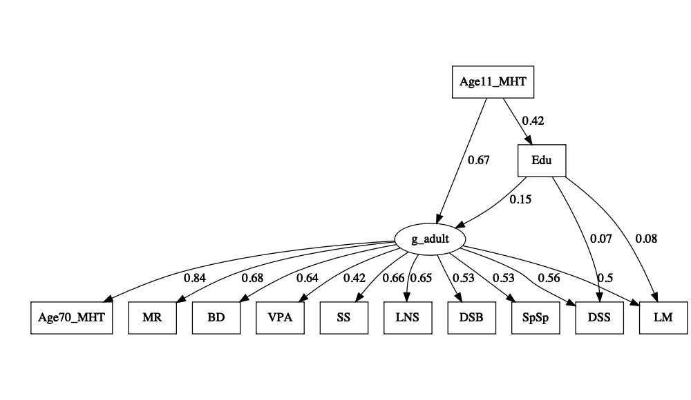
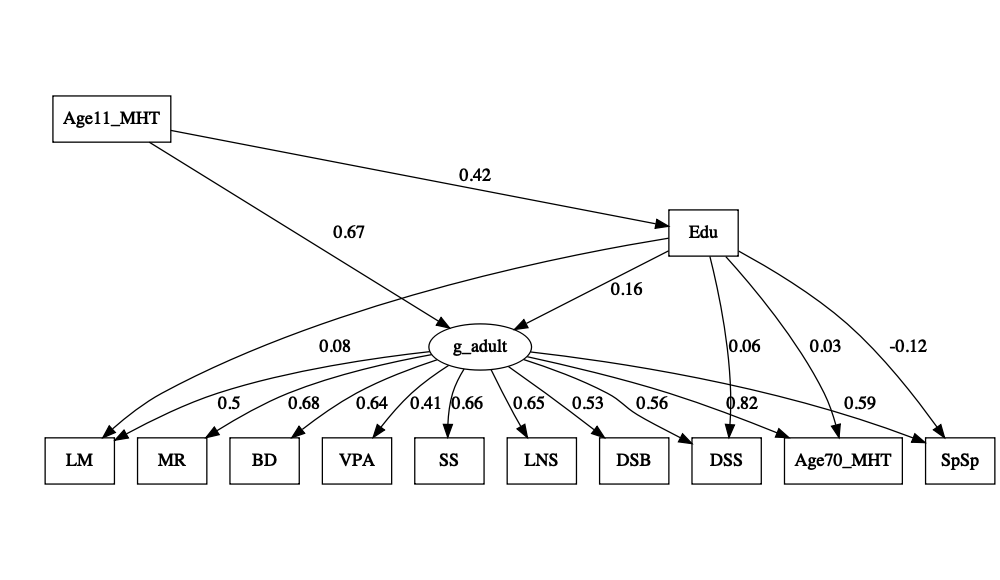

Re-analysis of Ritchie, Bates, Deary et al.
================
2024-07-16

## Load in the data

``` r
input_mat = '
1                                           
0.42    1                                       
0.43    0.31    1                                   
0.44    0.3 0.31    1                               
0.46    0.31    0.33    0.37    1                           
0.46    0.31    0.28    0.39    0.57    1                       
0.32    0.22    0.48    0.24    0.31    0.27    1                   
0.47    0.27    0.33    0.62    0.45    0.48    0.22    1               
0.45    0.25    0.4 0.41    0.44    0.4 0.3 0.45    1           
0.42    0.21    0.3 0.3 0.4 0.34    0.27    0.34    0.54    1       
0.28    0.14    0.24    0.31    0.38    0.4 0.16    0.41    0.42    0.32    1   
0.67    0.39    0.46    0.49    0.58    0.51    0.35    0.53    0.51    0.4 0.36    1'
input_names = c("Age11_MHT","Edu","LM","DSS","MR","BD","VPA","SS","LNS","DSB","SpSp","Age70_MHT")
cor_mat = getCov(input_mat, names = input_names, lower=T, diag=T  )
ntotal = 1028
```

## Fit and confirm the published models

“*Using modification indexes calculated in Mplus, we found five residual
covariances that were significant in the baseline model. Four of these
described clear content overlap in the tests (between Matrix Reasoning
and Block Design, Logical Memory and Verbal Paired Associates,
Digit-Symbol and Symbol Search, Digit Span Backwards and Letter-Number
Sequencing) and one was unexpectedly negative (between the MHT and
Spatial Span).*”

``` r
# ---
EduOnlyG.model <- '
g_adult =~ Age70_MHT + LM + DSS + MR + BD + VPA + SS + LNS + DSB + SpSp
g_adult + Edu ~ Age11_MHT
g_adult ~ Edu
Age70_MHT ~~ SpSp
MR ~~ BD
LM ~~ VPA
DSS ~~ SS
DSB ~~ LNS'

EduGandS.model <- '
g_adult =~ Age70_MHT + LM + DSS + MR + BD + VPA + SS + LNS + DSB + SpSp
g_adult + Edu ~ Age11_MHT
g_adult + DSS + LM ~ Edu
Age70_MHT ~~ SpSp
MR ~~ BD
LM ~~ VPA
DSS ~~ SS
DSB ~~ LNS'

EduOnlyS.model <- '
g_adult =~ Age70_MHT + LM + DSS + MR + BD + VPA + SS + LNS + DSB + SpSp
g_adult + Edu ~ Age11_MHT
Age70_MHT + LM + DSS + MR + BD + VPA + SS ~ Edu
MR ~~ BD
LM ~~ VPA
DSS ~~ SS
DSB ~~ LNS
Age70_MHT ~~ SpSp'

EduOnlyG.fit <- cfa(EduOnlyG.model, sample.cov = cor_mat , sample.nobs = ntotal , std.lv = T )
EduOnlyS.fit <- cfa(EduOnlyS.model, sample.cov = cor_mat , sample.nobs = ntotal , std.lv = T )
EduGandS.fit <- cfa(EduGandS.model, sample.cov = cor_mat , sample.nobs = ntotal , std.lv = T )

cat("Model 1" , fitMeasures(EduOnlyG.fit,c("rmsea","aic")),'\n')
```

    ## Model 1 0.05806203 27644.45

``` r
cat("Model 2" , fitMeasures(EduGandS.fit,c("rmsea","aic")),'\n')
```

    ## Model 2 0.05712551 27634.42

``` r
cat("Model 3" , fitMeasures(EduOnlyS.fit,c("rmsea","aic")),'\n')
```

    ## Model 3 0.05735391 27626.13

``` r
cat ("dAIC Only S vs. G and S" , fitMeasures(EduOnlyS.fit,"aic") - fitMeasures(EduGandS.fit,"aic") , '\n' )
```

    ## dAIC Only S vs. G and S -8.289836

``` r
cat ("dAIC Only S vs. Only G" , fitMeasures(EduOnlyS.fit,"aic") - fitMeasures(EduOnlyG.fit,"aic") , '\n' )
```

    ## dAIC Only S vs. Only G -18.32223

We confirm the lower (better) AIC for a model with paths only on S
compared to a model with paths to g and S, and much lower AIC for a
model only on g.

“*We then compared Model C to the previous models. It had significantly
better fit than both Model A, ΔAIC = 19.08, χ2(6) = 31.08, p \< .001;
and Model B, ΔAIC = 9.90, χ2(4) = 17.90, p = .001.*”

## Plot Model 1 : Only on g

``` r
lavaanPlot( model = EduOnlyG.fit , coefs=T , stand=T )
```

<!-- -->
\## Plot Model 2 : On g and s

``` r
lavaanPlot( model = EduGandS.fit , coefs=T , stand=T )
```

<!-- -->
\## Plot Model 3 : Only on s

``` r
lavaanPlot( model = EduOnlyS.fit , coefs=T , stand=T )
```

<!-- -->

## Do model selection for Model 2

``` r
# start without the effect of Edu on S

EduGandS.baseline <- '
g_adult =~ Age70_MHT + LM + DSS + MR + BD + VPA + SS + LNS + DSB + SpSp
g_adult + Edu ~ Age11_MHT
Age70_MHT ~~ SpSp
MR ~~ BD
LM ~~ VPA
DSS ~~ SS
DSB ~~ LNS'

all_vals = c("LM","DSS","MR","BD","VPA","SS","LNS","DSB","SpSp","Age70_MHT")
min_p = NA
included_vals = "g_adult"
# Iterate until no more significant paths
while( is.na(min_p) | min_p < 0.05 ) {
  # Iterate through all specific tests
  min_p = 1
  for ( i in 1:length(all_vals) ) {
      new_vals = c(included_vals,all_vals[i])
      eqn = paste(paste(new_vals,collapse=" + ")," ~ Edu",sep='')
      new_model = paste(EduGandS.baseline,'\n',eqn,sep='')
      EduGandS.fit <- cfa(new_model, sample.cov = cor_mat , sample.nobs = ntotal , std.lv = T)
      coefs = standardizedSolution(EduGandS.fit)
      cur_pv = coefs[coefs$lhs == all_vals[i] & coefs$op == "~" & coefs$rhs == "Edu","pvalue"]
      if ( cur_pv < min_p ) {
        min_val = all_vals[i]
        min_p = cur_pv
      }
  }
  
  # if there's a significant path, add it
  cat(min_val,min_p,'\n')
  if ( min_p < 0.05 ) {
    included_vals = c(included_vals,min_val)
    all_vals = setdiff(all_vals,min_val)
  }
  cat('\n')
}
```

    ## SpSp 3.793093e-05 
    ## 
    ## LM 0.01059601 
    ## 
    ## DSS 0.02503372 
    ## 
    ## LNS 0.08537644

``` r
# print final model
cat( "Final specific paths:" , included_vals , '\n' )
```

    ## Final specific paths: g_adult SpSp LM DSS

Interestingly, SpSp was the first selected path and highly significant.
LM and DSS were included as paths in Ritchie et al. but SpSp was not
(reasons unstated).

Now let’s test the relative model fit.

``` r
EduGandS_new.model <- '
g_adult =~ Age70_MHT + LM + DSS + MR + BD + VPA + SS + LNS + DSB + SpSp
g_adult + Edu ~ Age11_MHT
g_adult + DSS + LM + SpSp ~ Edu
Age70_MHT ~~ SpSp
MR ~~ BD
LM ~~ VPA
DSS ~~ SS
DSB ~~ LNS'

EduGandS_new.fit <- cfa(EduGandS_new.model, sample.cov = cor_mat , sample.nobs = ntotal , std.lv = T)
cat ("dAIC Only S vs. G and S (updated)" , fitMeasures(EduOnlyS.fit,"aic") - fitMeasures(EduGandS_new.fit,"aic") , '\n' )
```

    ## dAIC Only S vs. G and S (updated) 4.084667

The updated model fits better than the model only on S. Let’s visualize
it:

``` r
lavaanPlot( model = EduGandS_new.fit , coefs=T , stand=T )
```

<!-- -->
There’s a significant positive path from Edu to g, and a negative path
from Edu to SpSp. Let’s look at the stanardized coefficients:

``` r
standardizedSolution(EduGandS_new.fit)
```

    ##          lhs op       rhs est.std    se      z pvalue ci.lower ci.upper
    ## 1    g_adult =~ Age70_MHT   0.841 0.012 67.666  0.000    0.817    0.866
    ## 2    g_adult =~        LM   0.499 0.028 17.610  0.000    0.444    0.555
    ## 3    g_adult =~       DSS   0.558 0.026 21.149  0.000    0.506    0.610
    ## 4    g_adult =~        MR   0.678 0.019 36.287  0.000    0.641    0.714
    ## 5    g_adult =~        BD   0.639 0.020 31.520  0.000    0.599    0.678
    ## 6    g_adult =~       VPA   0.415 0.027 15.094  0.000    0.361    0.469
    ## 7    g_adult =~        SS   0.659 0.019 34.087  0.000    0.621    0.697
    ## 8    g_adult =~       LNS   0.646 0.020 32.583  0.000    0.607    0.685
    ## 9    g_adult =~       DSB   0.528 0.024 21.819  0.000    0.480    0.575
    ## 10   g_adult =~      SpSp   0.592 0.030 19.977  0.000    0.534    0.650
    ## 11   g_adult  ~ Age11_MHT   0.662 0.020 32.481  0.000    0.622    0.702
    ## 12       Edu  ~ Age11_MHT   0.420 0.025 17.123  0.000    0.372    0.468
    ## 13   g_adult  ~       Edu   0.170 0.027  6.338  0.000    0.118    0.223
    ## 14       DSS  ~       Edu   0.060 0.027  2.241  0.025    0.008    0.113
    ## 15        LM  ~       Edu   0.076 0.029  2.642  0.008    0.020    0.132
    ## 16      SpSp  ~       Edu  -0.121 0.032 -3.776  0.000   -0.184   -0.058
    ## 17 Age70_MHT ~~      SpSp  -0.200 0.043 -4.694  0.000   -0.284   -0.117
    ## 18        MR ~~        BD   0.242 0.032  7.514  0.000    0.179    0.305
    ## 19        LM ~~       VPA   0.334 0.028 11.742  0.000    0.279    0.390
    ## 20       DSS ~~        SS   0.387 0.028 13.674  0.000    0.332    0.442
    ## 21       LNS ~~       DSB   0.307 0.030 10.231  0.000    0.248    0.366
    ## 22 Age70_MHT ~~ Age70_MHT   0.292 0.021 13.950  0.000    0.251    0.333
    ## 23        LM ~~        LM   0.711 0.025 28.142  0.000    0.662    0.761
    ## 24       DSS ~~       DSS   0.655 0.026 25.389  0.000    0.604    0.705
    ## 25        MR ~~        MR   0.541 0.025 21.346  0.000    0.491    0.590
    ## 26        BD ~~        BD   0.592 0.026 22.870  0.000    0.541    0.643
    ## 27       VPA ~~       VPA   0.828 0.023 36.298  0.000    0.783    0.873
    ## 28        SS ~~        SS   0.566 0.025 22.198  0.000    0.516    0.616
    ## 29       LNS ~~       LNS   0.582 0.026 22.719  0.000    0.532    0.633
    ## 30       DSB ~~       DSB   0.721 0.026 28.243  0.000    0.671    0.771
    ## 31      SpSp ~~      SpSp   0.699 0.028 25.049  0.000    0.645    0.754
    ## 32       Edu ~~       Edu   0.824 0.021 39.973  0.000    0.783    0.864
    ## 33   g_adult ~~   g_adult   0.438 0.022 20.003  0.000    0.395    0.480
    ## 34 Age11_MHT ~~ Age11_MHT   1.000 0.000     NA     NA    1.000    1.000

## Sensitivity analysis: Remove SpSp entirely from the analysis

``` r
EduOnlyG.model <- '
g_adult =~ Age70_MHT + LM + DSS + MR + BD + VPA + SS + LNS + DSB
g_adult + Edu ~ Age11_MHT
g_adult ~ Edu
MR ~~ BD
LM ~~ VPA
DSS ~~ SS
DSB ~~ LNS'

EduGandS.model <- '
g_adult =~ Age70_MHT + LM + DSS + MR + BD + VPA + SS + LNS + DSB
g_adult + Edu ~ Age11_MHT
g_adult + DSS + LM ~ Edu
MR ~~ BD
LM ~~ VPA
DSS ~~ SS
DSB ~~ LNS'

EduOnlyS.model <- '
g_adult =~ Age70_MHT + LM + DSS + MR + BD + VPA + SS + LNS + DSB
g_adult + Edu ~ Age11_MHT
Age70_MHT + LM + DSS + MR + BD + VPA + SS ~ Edu
MR ~~ BD
LM ~~ VPA
DSS ~~ SS
DSB ~~ LNS'

EduOnlyG.fit <- cfa(EduOnlyG.model, sample.cov = cor_mat , sample.nobs = ntotal , std.lv = T )
EduOnlyS.fit <- cfa(EduOnlyS.model, sample.cov = cor_mat , sample.nobs = ntotal , std.lv = T )
EduGandS.fit <- cfa(EduGandS.model, sample.cov = cor_mat , sample.nobs = ntotal , std.lv = T )

cat("Model 1" , fitMeasures(EduOnlyG.fit,c("rmsea","aic")),'\n')
```

    ## Model 1 0.04781269 24981.4

``` r
cat("Model 2" , fitMeasures(EduGandS.fit,c("rmsea","aic")),'\n')
```

    ## Model 2 0.04685773 24975.26

``` r
cat("Model 3" , fitMeasures(EduOnlyS.fit,c("rmsea","aic")),'\n')
```

    ## Model 3 0.04997851 24980.49

``` r
fitMeasures(EduOnlyS.fit,"aic") - fitMeasures(EduGandS.fit,"aic")
```

    ##   aic 
    ## 5.223

``` r
fitMeasures(EduOnlyS.fit,"aic") - fitMeasures(EduOnlyG.fit,"aic")
```

    ##    aic 
    ## -0.915

The model with Edu paths to g and S still fits better than a model with
only paths to S. Moreover, the model with paths only to g now has
approximately the same fit as the model with paths only to S. All of the
primary results were apparently driven by the inclusion of SpSp.
