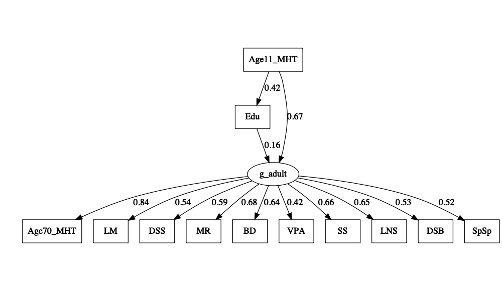

Re-analysis of Ritchie, Bates, Deary : Is Education Associated With
Improvements in General Cognitive Ability, or in Specific Skills?
================
2024-07-16

## Load in the data

``` r
input_mat = '
1                                           
0.42    1                                       
0.43    0.31    1                                   
0.44    0.3 0.31    1                               
0.46    0.31    0.33    0.37    1                           
0.46    0.31    0.28    0.39    0.57    1                       
0.32    0.22    0.48    0.24    0.31    0.27    1                   
0.47    0.27    0.33    0.62    0.45    0.48    0.22    1               
0.45    0.25    0.4 0.41    0.44    0.4 0.3 0.45    1           
0.42    0.21    0.3 0.3 0.4 0.34    0.27    0.34    0.54    1       
0.28    0.14    0.24    0.31    0.38    0.4 0.16    0.41    0.42    0.32    1   
0.67    0.39    0.46    0.49    0.58    0.51    0.35    0.53    0.51    0.4 0.36    1'
input_names = c("Age11_MHT","Edu","LM","DSS","MR","BD","VPA","SS","LNS","DSB","SpSp","Age70_MHT")
cor_mat = getCov(input_mat, names = input_names, lower=T, diag=T  )
ntotal = 1091
```

## Fit and confirm the published models

The set up of the published models:

“*Using modification indexes calculated in Mplus, we found five residual
covariances that were significant in the baseline model. Four of these
described clear content overlap in the tests (between Matrix Reasoning
and Block Design, Logical Memory and Verbal Paired Associates,
Digit-Symbol and Symbol Search, Digit Span Backwards and Letter-Number
Sequencing) and one was unexpectedly negative (between the MHT and
Spatial Span).*”

``` r
# ---
EduOnlyG.model <- '
g_adult =~ Age70_MHT + LM + DSS + MR + BD + VPA + SS + LNS + DSB + SpSp
g_adult + Edu ~ Age11_MHT
g_adult ~ Edu
Age70_MHT ~~ SpSp
MR ~~ BD
LM ~~ VPA
DSS ~~ SS
DSB ~~ LNS'

EduGandS.model <- '
g_adult =~ Age70_MHT + LM + DSS + MR + BD + VPA + SS + LNS + DSB + SpSp
g_adult + Edu ~ Age11_MHT
g_adult + DSS + LM ~ Edu
Age70_MHT ~~ SpSp
MR ~~ BD
LM ~~ VPA
DSS ~~ SS
DSB ~~ LNS'

EduOnlyS.model <- '
g_adult =~ Age70_MHT + LM + DSS + MR + BD + VPA + SS + LNS + DSB + SpSp
g_adult + Edu ~ Age11_MHT
Age70_MHT + LM + DSS + MR + BD + VPA + SS ~ Edu
MR ~~ BD
LM ~~ VPA
DSS ~~ SS
DSB ~~ LNS
Age70_MHT ~~ SpSp'

EduOnlyG.fit <- cfa(EduOnlyG.model, sample.cov = cor_mat , sample.nobs = ntotal , std.lv = T )
EduGandS.fit <- cfa(EduGandS.model, sample.cov = cor_mat , sample.nobs = ntotal , std.lv = T )
EduOnlyS.fit <- cfa(EduOnlyS.model, sample.cov = cor_mat , sample.nobs = ntotal , std.lv = T )

cat("Model 1 RMSEA and AIC" , fitMeasures(EduOnlyG.fit,c("rmsea","aic")),'\n')
```

    ## Model 1 RMSEA and AIC 0.05854376 29335.73

``` r
cat("Model 2 RMSEA and AIC" , fitMeasures(EduGandS.fit,c("rmsea","aic")),'\n')
```

    ## Model 2 RMSEA and AIC 0.05761507 29324.84

``` r
cat("Model 3 RMSEA and AIC" , fitMeasures(EduOnlyS.fit,c("rmsea","aic")),'\n')
```

    ## Model 3 RMSEA and AIC 0.05784154 29315.55

``` r
cat ("delta AIC: Only S vs. G and S" , fitMeasures(EduOnlyS.fit,"aic") - fitMeasures(EduGandS.fit,"aic") , '\n' )
```

    ## delta AIC: Only S vs. G and S -9.288143

``` r
cat ("delta AIC: Only S vs. Only G" , fitMeasures(EduOnlyS.fit,"aic") - fitMeasures(EduOnlyG.fit,"aic") , '\n' )
```

    ## delta AIC: Only S vs. Only G -20.1805

``` r
cat ("delta chisq: Only S vs. G and S" , fitMeasures(EduOnlyS.fit,"chisq") - fitMeasures(EduGandS.fit,"chisq") , '\n' )
```

    ## delta chisq: Only S vs. G and S -17.28814

``` r
cat ("delta chisq: Only S vs. Only G" , fitMeasures(EduOnlyS.fit,"chisq") - fitMeasures(EduOnlyG.fit,"chisq") , '\n' )
```

    ## delta chisq: Only S vs. Only G -32.1805

Replicating the published result (quoted below), the AIC was better
(lower) for a model with paths from Edu only to S’s compared to a model
with paths from Edu to g and S’s, and much better than a model with with
paths from Edu only on g.

The published results: “*We then compared Model C to the previous
models. It had significantly better fit than both Model A, ΔAIC = 19.08,
χ2(6) = 31.08, p \< .001; and Model B, ΔAIC = 9.90, χ2(4) = 17.90, p =
.001.*”

We also see above that the delta chisq statistics match, even though
this is not a nested model comparison and the p-values are not valid.

Finally, let’s double check that the published g-loadings from Model 1
match the g-loadings we obtained.

``` r
input_names = c("Age11_MHT","Edu","LM","DSS","MR","BD","VPA","SS","LNS","DSB","SpSp","Age70_MHT")
published_g_loadings = c(0.85, 0.67, 0.66, 0.66, 0.63, 0.59, 0.55, 0.53, 0.52, 0.43)
published_g_names = c("Age70_MHT","MR","LNS","SS","BD","DSS","LM","DSB","SpSp","VPA")
coefs = standardizedSolution(EduOnlyG.fit)
coefs = coefs[ coefs$op == "=~" , ]
published_g_loadings = published_g_loadings[ match(coefs$rhs,published_g_names) ]
cat( "Correlation of g loadings:" , cor( published_g_loadings , coefs$est.std ) )
```

    ## Correlation of g loadings: 0.9975177

``` r
plot( published_g_loadings , coefs$est.std , xlab="Published g loadings", ylab="Recovered g loadings",bty="n",xlim=c(0,1),ylim=c(0,1))
abline(0,1,lty=3,col="gray")
```

<!-- -->

## Plot Model 1 : Only on g

``` r
lavaanPlot( model = EduOnlyG.fit , coefs=T , stand=T )
```

<!-- -->

## Plot Model 2 : On g and specific skills

``` r
lavaanPlot( model = EduGandS.fit , coefs=T , stand=T )
```

<!-- -->

## Plot Model 3 : Only on specific skils

``` r
lavaanPlot( model = EduOnlyS.fit , coefs=T , stand=T )
```

<!-- -->

All models are visually consistent with what’s reported in Ritchie et
al. We have replicated the findings using the summary correlation
matrix. Now let’s investigate the fitting of Model 2 (Edu on g and
specific skills).

## Do forward model selection for Model 2

Ritchie et al. do not provide information on how Model 2 (Edu on g and
S’s) was constructed. Let’s do simple forward selection where we add
paths if they are significant.

``` r
# start without the effect of Edu on S

EduGandS.baseline <- '
g_adult =~ Age70_MHT + LM + DSS + MR + BD + VPA + SS + LNS + DSB + SpSp
g_adult + Edu ~ Age11_MHT
Age70_MHT ~~ SpSp
MR ~~ BD
LM ~~ VPA
DSS ~~ SS
DSB ~~ LNS'

all_vals = c("LM","DSS","MR","BD","VPA","SS","LNS","DSB","SpSp","Age70_MHT")
min_p = NA
included_vals = "g_adult"
# Iterate until no more significant paths
ctr = 1
while( is.na(min_p) | min_p < 0.05 ) {
  # Iterate through all specific tests
  min_p = 1
  for ( i in 1:length(all_vals) ) {
      new_vals = c(included_vals,all_vals[i])
      eqn = paste(paste(new_vals,collapse=" + ")," ~ Edu",sep='')
      new_model = paste(EduGandS.baseline,'\n',eqn,sep='')
      EduGandS.fit <- cfa(new_model, sample.cov = cor_mat , sample.nobs = ntotal , std.lv = T)
      coefs = standardizedSolution(EduGandS.fit)
      cur_pv = coefs[coefs$lhs == all_vals[i] & coefs$op == "~" & coefs$rhs == "Edu","pvalue"]
      if ( cur_pv < min_p ) {
        min_val = all_vals[i]
        min_p = cur_pv
      }
  }
  
  # if there's a significant path, add it
  cat("Iteration" , ctr , "Minimum p-value" , min_p , "for item" , min_val, '\n')
  if ( min_p < 0.05 ) {
    cat("--- Item" , min_val , "is added\n")
    included_vals = c(included_vals,min_val)
    all_vals = setdiff(all_vals,min_val)
  }
  ctr = ctr + 1
}
```

    ## Iteration 1 Minimum p-value 2.194779e-05 for item SpSp 
    ## --- Item SpSp is added
    ## Iteration 2 Minimum p-value 0.008466029 for item LM 
    ## --- Item LM is added
    ## Iteration 3 Minimum p-value 0.02096986 for item DSS 
    ## --- Item DSS is added
    ## Iteration 4 Minimum p-value 0.07635598 for item LNS

``` r
# print final model
cat( "Final specific paths:" , included_vals , '\n' )
```

    ## Final specific paths: g_adult SpSp LM DSS

Interestingly, SpSp was the first selected path and highly significant.
LM and DSS were included as paths in Ritchie et al. but SpSp was not
(reasons unstated).

Now let’s test the relative model fit.

``` r
EduGandS_new.model <- '
g_adult =~ Age70_MHT + LM + DSS + MR + BD + VPA + SS + LNS + DSB + SpSp
g_adult + Edu ~ Age11_MHT
g_adult + DSS + LM + SpSp ~ Edu
Age70_MHT ~~ SpSp
MR ~~ BD
LM ~~ VPA
DSS ~~ SS
DSB ~~ LNS'

EduGandS_new.fit <- cfa(EduGandS_new.model, sample.cov = cor_mat , sample.nobs = ntotal , std.lv = T)

cat( "Refit model 2 RMSEA and AIC:" , fitMeasures(EduGandS_new.fit,c("rmsea","aic")), '\n' )
```

    ## Refit model 2 RMSEA and AIC: 0.05570367 29311.58

``` r
cat ("delta AIC Only S vs. G and S (with refit paths)" , fitMeasures(EduOnlyS.fit,"aic") - fitMeasures(EduGandS_new.fit,"aic") , '\n' )
```

    ## delta AIC Only S vs. G and S (with refit paths) 3.967287

The updated model fits better than the model only on S. Let’s visualize
it:

``` r
lavaanPlot( model = EduGandS_new.fit , coefs=T , stand=T )
```

<!-- -->

There’s a significant positive path from Edu to g, and a negative path
from Edu to SpSp. Let’s look at the stanardized coefficients and also
the g \~ Edu coefficient:

``` r
coefs = standardizedSolution(EduGandS_new.fit)
coefs
```

    ##          lhs op       rhs est.std    se      z pvalue ci.lower ci.upper
    ## 1    g_adult =~ Age70_MHT   0.841 0.012 69.709  0.000    0.818    0.865
    ## 2    g_adult =~        LM   0.499 0.028 18.142  0.000    0.445    0.553
    ## 3    g_adult =~       DSS   0.558 0.026 21.787  0.000    0.508    0.608
    ## 4    g_adult =~        MR   0.678 0.018 37.382  0.000    0.642    0.713
    ## 5    g_adult =~        BD   0.639 0.020 32.471  0.000    0.600    0.677
    ## 6    g_adult =~       VPA   0.415 0.027 15.550  0.000    0.363    0.467
    ## 7    g_adult =~        SS   0.659 0.019 35.116  0.000    0.622    0.696
    ## 8    g_adult =~       LNS   0.646 0.019 33.566  0.000    0.608    0.684
    ## 9    g_adult =~       DSB   0.528 0.023 22.478  0.000    0.482    0.574
    ## 10   g_adult =~      SpSp   0.592 0.029 20.581  0.000    0.535    0.648
    ## 11   g_adult  ~ Age11_MHT   0.662 0.020 33.461  0.000    0.624    0.701
    ## 12       Edu  ~ Age11_MHT   0.420 0.024 17.640  0.000    0.373    0.467
    ## 13   g_adult  ~       Edu   0.170 0.026  6.530  0.000    0.119    0.221
    ## 14       DSS  ~       Edu   0.060 0.026  2.309  0.021    0.009    0.111
    ## 15        LM  ~       Edu   0.076 0.028  2.722  0.006    0.021    0.131
    ## 16      SpSp  ~       Edu  -0.121 0.031 -3.890  0.000   -0.182   -0.060
    ## 17 Age70_MHT ~~      SpSp  -0.200 0.041 -4.836  0.000   -0.281   -0.119
    ## 18        MR ~~        BD   0.242 0.031  7.741  0.000    0.181    0.304
    ## 19        LM ~~       VPA   0.334 0.028 12.097  0.000    0.280    0.389
    ## 20       DSS ~~        SS   0.387 0.027 14.086  0.000    0.333    0.441
    ## 21       LNS ~~       DSB   0.307 0.029 10.539  0.000    0.250    0.364
    ## 22 Age70_MHT ~~ Age70_MHT   0.292 0.020 14.371  0.000    0.252    0.332
    ## 23        LM ~~        LM   0.711 0.025 28.991  0.000    0.663    0.759
    ## 24       DSS ~~       DSS   0.655 0.025 26.155  0.000    0.606    0.704
    ## 25        MR ~~        MR   0.541 0.025 21.990  0.000    0.492    0.589
    ## 26        BD ~~        BD   0.592 0.025 23.561  0.000    0.543    0.641
    ## 27       VPA ~~       VPA   0.828 0.022 37.394  0.000    0.784    0.871
    ## 28        SS ~~        SS   0.566 0.025 22.868  0.000    0.517    0.614
    ## 29       LNS ~~       LNS   0.582 0.025 23.405  0.000    0.534    0.631
    ## 30       DSB ~~       DSB   0.721 0.025 29.095  0.000    0.673    0.770
    ## 31      SpSp ~~      SpSp   0.699 0.027 25.805  0.000    0.646    0.753
    ## 32       Edu ~~       Edu   0.824 0.020 41.180  0.000    0.784    0.863
    ## 33   g_adult ~~   g_adult   0.438 0.021 20.606  0.000    0.396    0.479
    ## 34 Age11_MHT ~~ Age11_MHT   1.000 0.000     NA     NA    1.000    1.000

``` r
coefs[ coefs$lhs == "g_adult" & coefs$rhs == "Edu" , ]
```

    ##        lhs op rhs est.std    se    z pvalue ci.lower ci.upper
    ## 13 g_adult  ~ Edu    0.17 0.026 6.53      0    0.119    0.221

The effect of education on adult g is clearly highly significant in this
model (Z-score of 6.5).

## Sensitivity analysis: Backward elimination

An alternative to forward selection is to start with all paths and drop
the paths that improve model fit. This is how the analysis is described
in Ritchie et al:

“*”Finally, for testing the significance of individual paths within the
models, we dropped them from the model (set their path weight to zero)
and tested the significance of the resulting change in model fit, also
using the chi-square test.*”

Unfortunately this approach is not identifiable for the proposed latent
variable model: dropping a single path produces identical chi-square
statistics because the path can just be accommodated by g.

We can verify this by starting with a model that contains all paths,
dropping each in turn, and showing that the chisq is the same:

``` r
# start without the effect of Edu on S

EduGandS.baseline <- '
g_adult =~ Age70_MHT + LM + DSS + MR + BD + VPA + SS + LNS + DSB + SpSp
g_adult + Edu ~ Age11_MHT
Age70_MHT ~~ SpSp
MR ~~ BD
LM ~~ VPA
DSS ~~ SS
DSB ~~ LNS'

all_vals = c("LM","DSS","MR","BD","VPA","SS","LNS","DSB","SpSp","Age70_MHT")
included_vals = all_vals

min_chisq = 1e3
for ( i in 1:length(all_vals) ) {
    new_vals = c("g_adult",setdiff(included_vals,all_vals[i]) )
    eqn = paste(paste(new_vals,collapse=" + ")," ~ Edu",sep='')
    new_model = paste(EduGandS.baseline,'\n',eqn,sep='')
    EduGandS.fit <- cfa(new_model, sample.cov = cor_mat , sample.nobs = ntotal , std.lv = T)
    cur_chisq = fitMeasures(EduGandS.fit,"chisq")
    cur_df = fitMeasures(EduGandS.fit,"df")
    cat( "Dropped" , all_vals[i] , "chisq" , cur_chisq , "df" , cur_df , '\n' )
}
```

    ## Dropped LM chisq 187.2297 df 39 
    ## Dropped DSS chisq 187.2297 df 39 
    ## Dropped MR chisq 187.2297 df 39 
    ## Dropped BD chisq 187.2297 df 39 
    ## Dropped VPA chisq 187.2297 df 39 
    ## Dropped SS chisq 187.2297 df 39 
    ## Dropped LNS chisq 187.2297 df 39 
    ## Dropped DSB chisq 187.2297 df 39 
    ## Dropped SpSp chisq 187.2297 df 39 
    ## Dropped Age70_MHT chisq 187.2297 df 39

We thus first have to drop an ad hoc path before we can do backward
elimination. Just to see how this works, let’s drop Verbal Paired
Associations, which had the lowest g-loading in Model 3 (Edu only
effects S’s).

``` r
# start without the effect of Edu on S

EduGandS.baseline <- '
g_adult =~ Age70_MHT + LM + DSS + MR + BD + VPA + SS + LNS + DSB + SpSp
g_adult + Edu ~ Age11_MHT
Age70_MHT ~~ SpSp
MR ~~ BD
LM ~~ VPA
DSS ~~ SS
DSB ~~ LNS'

all_vals = c("LM","DSS","MR","BD","SS","LNS","DSB","SpSp","Age70_MHT")
included_vals = all_vals
ctr = 0
while ( TRUE ) {
  ctr = ctr + 1
  cat( "\n# Iteration" , ctr , '\n' )
  # Fit the baseline model
  new_vals = c("g_adult",included_vals)
  eqn = paste(paste(new_vals,collapse=" + ")," ~ Edu",sep='')
  new_model = paste(EduGandS.baseline,'\n',eqn,sep='')
  EduGandS.fit <- cfa(new_model, sample.cov = cor_mat , sample.nobs = ntotal , std.lv = T)
  prev_chisq = fitMeasures(EduGandS.fit,"chisq")
  prev_df = fitMeasures(EduGandS.fit,"df")
  min_chisq = 10e3
  
  for ( i in 1:length(included_vals) ) {
      new_vals = c("g_adult",setdiff(included_vals,included_vals[i]) )
      eqn = paste(paste(new_vals,collapse=" + ")," ~ Edu",sep='')
      new_model = paste(EduGandS.baseline,'\n',eqn,sep='')
      EduGandS.fit <- cfa(new_model, sample.cov = cor_mat , sample.nobs = ntotal , std.lv = T)
      cur_chisq = fitMeasures(EduGandS.fit,"chisq")
      cur_df = fitMeasures(EduGandS.fit,"df")
      
      cat( "Consider dropping" , included_vals[i] , "chisq" , cur_chisq , "df" , cur_df , '\n' )
  
      if ( cur_chisq < min_chisq ) {
        min_val = included_vals[i]
        min_chisq = cur_chisq
        min_df = cur_df
      }
  }
  
  # compute the model difference
  cat( "Previous model chisq" , prev_chisq , prev_df , '\n' )
  cat( "Lowest model element" , min_val , "chisq" , min_chisq , "df" , min_df , '\n' )
  pv_diff = pchisq( (min_chisq - prev_chisq) , (min_df - prev_df) , lower.tail=F)
  cat( "P-value for difference" , pv_diff , '\n' )
  if ( pv_diff > 0.05 ) {
    cat( "Dropping" , min_val , '\n' )
    included_vals = setdiff(included_vals,min_val)
  } else {
    break
  }
}
```

    ## 
    ## # Iteration 1 
    ## Consider dropping LM chisq 187.8351 df 40 
    ## Consider dropping DSS chisq 187.3242 df 40 
    ## Consider dropping MR chisq 188.4649 df 40 
    ## Consider dropping BD chisq 187.6819 df 40 
    ## Consider dropping SS chisq 190.6003 df 40 
    ## Consider dropping LNS chisq 191.9675 df 40 
    ## Consider dropping DSB chisq 190.621 df 40 
    ## Consider dropping SpSp chisq 200.5844 df 40 
    ## Consider dropping Age70_MHT chisq 188.3567 df 40 
    ## Previous model chisq 187.2297 39 
    ## Lowest model element DSS chisq 187.3242 df 40 
    ## P-value for difference 0.7586119 
    ## Dropping DSS 
    ## 
    ## # Iteration 2 
    ## Consider dropping LM chisq 188.9155 df 41 
    ## Consider dropping MR chisq 189.1283 df 41 
    ## Consider dropping BD chisq 187.7625 df 41 
    ## Consider dropping SS chisq 196.0361 df 41 
    ## Consider dropping LNS chisq 195.8891 df 41 
    ## Consider dropping DSB chisq 192.2878 df 41 
    ## Consider dropping SpSp chisq 209.6144 df 41 
    ## Consider dropping Age70_MHT chisq 189.2318 df 41 
    ## Previous model chisq 187.3242 40 
    ## Lowest model element BD chisq 187.7625 df 41 
    ## P-value for difference 0.5079033 
    ## Dropping BD 
    ## 
    ## # Iteration 3 
    ## Consider dropping LM chisq 190.3183 df 42 
    ## Consider dropping MR chisq 189.1809 df 42 
    ## Consider dropping SS chisq 196.4274 df 42 
    ## Consider dropping LNS chisq 196.6153 df 42 
    ## Consider dropping DSB chisq 192.3526 df 42 
    ## Consider dropping SpSp chisq 211.4192 df 42 
    ## Consider dropping Age70_MHT chisq 189.2695 df 42 
    ## Previous model chisq 187.7625 41 
    ## Lowest model element MR chisq 189.1809 df 42 
    ## P-value for difference 0.2336679 
    ## Dropping MR 
    ## 
    ## # Iteration 4 
    ## Consider dropping LM chisq 192.7464 df 43 
    ## Consider dropping SS chisq 196.6601 df 43 
    ## Consider dropping LNS chisq 196.7131 df 43 
    ## Consider dropping DSB chisq 192.834 df 43 
    ## Consider dropping SpSp chisq 211.422 df 43 
    ## Consider dropping Age70_MHT chisq 189.8401 df 43 
    ## Previous model chisq 189.1809 42 
    ## Lowest model element Age70_MHT chisq 189.8401 df 43 
    ## P-value for difference 0.4168508 
    ## Dropping Age70_MHT 
    ## 
    ## # Iteration 5 
    ## Consider dropping LM chisq 194.5609 df 44 
    ## Consider dropping SS chisq 196.6601 df 44 
    ## Consider dropping LNS chisq 196.7538 df 44 
    ## Consider dropping DSB chisq 192.916 df 44 
    ## Consider dropping SpSp chisq 211.4283 df 44 
    ## Previous model chisq 189.8401 43 
    ## Lowest model element DSB chisq 192.916 df 44 
    ## P-value for difference 0.07946122 
    ## Dropping DSB 
    ## 
    ## # Iteration 6 
    ## Consider dropping LM chisq 198.2559 df 45 
    ## Consider dropping SS chisq 198.9877 df 45 
    ## Consider dropping LNS chisq 197.3892 df 45 
    ## Consider dropping SpSp chisq 212.9926 df 45 
    ## Previous model chisq 192.916 44 
    ## Lowest model element LNS chisq 197.3892 df 45 
    ## P-value for difference 0.03442982

``` r
# print final model
cat( "Final specific paths:" , included_vals , '\n' )
```

    ## Final specific paths: LM SS LNS SpSp

This model is slightly more complex but still includes LM, SS, and SpSp.
Now let’s retest this model:

``` r
EduGandS_new.model <- '
g_adult =~ Age70_MHT + LM + DSS + MR + BD + VPA + SS + LNS + DSB + SpSp
g_adult + Edu ~ Age11_MHT
g_adult + DSS + LM + LNS + SpSp ~ Edu
Age70_MHT ~~ SpSp
MR ~~ BD
LM ~~ VPA
DSS ~~ SS
DSB ~~ LNS'

EduGandS_new.fit <- cfa(EduGandS_new.model, sample.cov = cor_mat , sample.nobs = ntotal , std.lv = T)
cat ("delta AIC Only S vs. G and S (with refit paths)" , fitMeasures(EduOnlyS.fit,"aic") - fitMeasures(EduGandS_new.fit,"aic") , '\n' )
```

    ## delta AIC Only S vs. G and S (with refit paths) 5.096405

This model still fits better than the model with only effects on S.

What if instead of dropping VPA we dropped SpSp first and then used
backward elimination to find paths:

``` r
# start without the effect of Edu on S

EduGandS.baseline <- '
g_adult =~ Age70_MHT + LM + DSS + MR + BD + VPA + SS + LNS + DSB + SpSp
g_adult + Edu ~ Age11_MHT
Age70_MHT ~~ SpSp
MR ~~ BD
LM ~~ VPA
DSS ~~ SS
DSB ~~ LNS'

all_vals = c("Age70_MHT","LM","DSS","MR","BD","VPA","SS","LNS","DSB")
included_vals = all_vals
ctr = 0
while ( TRUE ) {
  ctr = ctr + 1
  cat( "\n# Iteration" , ctr , '\n' )
  # Fit the baseline model
  new_vals = c("g_adult",included_vals)
  eqn = paste(paste(new_vals,collapse=" + ")," ~ Edu",sep='')
  new_model = paste(EduGandS.baseline,'\n',eqn,sep='')
  EduGandS.fit <- cfa(new_model, sample.cov = cor_mat , sample.nobs = ntotal , std.lv = T)
  prev_chisq = fitMeasures(EduGandS.fit,"chisq")
  prev_df = fitMeasures(EduGandS.fit,"df")
  min_chisq = 10e3
  
  for ( i in 1:length(included_vals) ) {
      new_vals = c("g_adult",setdiff(included_vals,included_vals[i]) )
      eqn = paste(paste(new_vals,collapse=" + ")," ~ Edu",sep='')
      new_model = paste(EduGandS.baseline,'\n',eqn,sep='')
      EduGandS.fit <- cfa(new_model, sample.cov = cor_mat , sample.nobs = ntotal , std.lv = T)
      cur_chisq = fitMeasures(EduGandS.fit,"chisq")
      cur_df = fitMeasures(EduGandS.fit,"df")
      
      cat( "Consider dropping" , included_vals[i] , "chisq" , cur_chisq , "df" , cur_df , '\n' )
  
      if ( cur_chisq < min_chisq ) {
        min_val = included_vals[i]
        min_chisq = cur_chisq
        min_df = cur_df
      }
  }
  
  # compute the model difference
  cat( "Previous model chisq" , prev_chisq , prev_df , '\n' )
  cat( "Lowest model element" , min_val , "chisq" , min_chisq , "df" , min_df , '\n' )
  pv_diff = pchisq( (min_chisq - prev_chisq) , (min_df - prev_df) , lower.tail=F)
  cat( "P-value for difference" , pv_diff , '\n' )
  if ( pv_diff > 0.05 ) {
    cat( "Dropping" , min_val , '\n' )
    included_vals = setdiff(included_vals,min_val)
  } else {
    break
  }
}
```

    ## 
    ## # Iteration 1 
    ## Consider dropping Age70_MHT chisq 203.9903 df 40 
    ## Consider dropping LM chisq 214.3358 df 40 
    ## Consider dropping DSS chisq 206.0919 df 40 
    ## Consider dropping MR chisq 201.2708 df 40 
    ## Consider dropping BD chisq 204.3437 df 40 
    ## Consider dropping VPA chisq 200.5844 df 40 
    ## Consider dropping SS chisq 194.9068 df 40 
    ## Consider dropping LNS chisq 192.5336 df 40 
    ## Consider dropping DSB chisq 192.0345 df 40 
    ## Previous model chisq 187.2297 39 
    ## Lowest model element DSB chisq 192.0345 df 40 
    ## P-value for difference 0.0283815

``` r
# print final model
cat( "Final specific paths:" , included_vals , '\n' )
```

    ## Final specific paths: Age70_MHT LM DSS MR BD VPA SS LNS DSB

This also does not get us back the Ritchie et al model, as very many
paths are retained. Not shown, but there is NO starting configuration
that gets you back to a model that only contains DSS and LM paths but no
SpSp path. Ritchie et al. must have dropped the SpSp path because it was
negative or for ad hoc reasons or used some other model selection
approach.

## Sensitivity analysis: Remove SpSp entirely from the analysis

It is odd that Education has a negative effect on Spatial Span and
Spatial Span has a negative covariance with the MHT, so let’s remove it
entirely from the model and see what happens.

``` r
EduOnlyG.model <- '
g_adult =~ Age70_MHT + LM + DSS + MR + BD + VPA + SS + LNS + DSB
g_adult + Edu ~ Age11_MHT
g_adult ~ Edu
MR ~~ BD
LM ~~ VPA
DSS ~~ SS
DSB ~~ LNS'

EduGandS.model <- '
g_adult =~ Age70_MHT + LM + DSS + MR + BD + VPA + SS + LNS + DSB
g_adult + Edu ~ Age11_MHT
g_adult + DSS + LM ~ Edu
MR ~~ BD
LM ~~ VPA
DSS ~~ SS
DSB ~~ LNS'

EduOnlyS.model <- '
g_adult =~ Age70_MHT + LM + DSS + MR + BD + VPA + SS + LNS + DSB
g_adult + Edu ~ Age11_MHT
Age70_MHT + LM + DSS + MR + BD + VPA + SS ~ Edu
MR ~~ BD
LM ~~ VPA
DSS ~~ SS
DSB ~~ LNS'

EduOnlyG.fit <- cfa(EduOnlyG.model, sample.cov = cor_mat , sample.nobs = ntotal , std.lv = T )
EduOnlyS.fit <- cfa(EduOnlyS.model, sample.cov = cor_mat , sample.nobs = ntotal , std.lv = T )
EduGandS.fit <- cfa(EduGandS.model, sample.cov = cor_mat , sample.nobs = ntotal , std.lv = T )

cat("Model 1 RMSEA and AIC" , fitMeasures(EduOnlyG.fit,c("rmsea","aic")),'\n')
```

    ## Model 1 RMSEA and AIC 0.04839654 26509.79

``` r
cat("Model 2 RMSEA and AIC" , fitMeasures(EduGandS.fit,c("rmsea","aic")),'\n')
```

    ## Model 2 RMSEA and AIC 0.04745333 26503.03

``` r
cat("Model 3 RMSEA and AIC" , fitMeasures(EduOnlyS.fit,c("rmsea","aic")),'\n')
```

    ## Model 3 RMSEA and AIC 0.05053735 26508.08

``` r
cat ("delta AIC: Only S vs. G and S" , fitMeasures(EduOnlyS.fit,"aic") - fitMeasures(EduGandS.fit,"aic") , '\n' )
```

    ## delta AIC: Only S vs. G and S 5.053328

``` r
cat ("delta AIC: Only S vs. Only G" , fitMeasures(EduOnlyS.fit,"aic") - fitMeasures(EduOnlyG.fit,"aic") , '\n' )
```

    ## delta AIC: Only S vs. Only G -1.70685

The model with Edu paths to g and S still fits better than a model with
only paths to S. Moreover, the model with paths only to g now has
approximately the same fit as the model with paths only to S (AIC
difference of \~1.7). It appears that all of the primary results were
driven by the inclusion of SpSp but no paths to SpSp. After removing
SpSp and using the models in the paper, there are essentially no
differences between the models, though the model with paths to g and S’s
has the lowest (best) AIC.

## Extra Credit: What about paths from Age 11 IQ?

Just for fun, let’s take Model 1 and test for whether there are any
paths directly from Age 11 IQ to specific skills. We’ll use our forward
selection code:

``` r
# start without the effect of Edu on S

EduGandS.baseline <- '
g_adult =~ Age70_MHT + LM + DSS + MR + BD + VPA + SS + LNS + DSB + SpSp
g_adult + Edu ~ Age11_MHT
g_adult ~ Edu
Age70_MHT ~~ SpSp
MR ~~ BD
LM ~~ VPA
DSS ~~ SS
DSB ~~ LNS'

all_vals = c("LM","DSS","MR","BD","VPA","SS","LNS","DSB","SpSp","Age70_MHT")
min_p = NA
included_vals = vector()
# Iterate until no more significant paths
ctr = 1
while( is.na(min_p) | min_p < 0.05 ) {
  # Iterate through all specific tests
  min_p = 1
  for ( i in 1:length(all_vals) ) {
      new_vals = c(included_vals,all_vals[i])
      eqn = paste(paste(new_vals,collapse=" + ")," ~ Age11_MHT",sep='')
      new_model = paste(EduGandS.baseline,'\n',eqn,sep='')
      EduGandS.fit <- cfa(new_model, sample.cov = cor_mat , sample.nobs = ntotal , std.lv = T)
      coefs = standardizedSolution(EduGandS.fit)
      cur_pv = coefs[coefs$lhs == all_vals[i] & coefs$op == "~" & coefs$rhs == "Age11_MHT","pvalue"]
      if ( cur_pv < min_p ) {
        min_val = all_vals[i]
        min_p = cur_pv
      }
  }
  
  # if there's a significant path, add it
  cat("Iteration" , ctr , "Minimum p-value" , min_p , "for item" , min_val, '\n')
  if ( min_p < 0.05 ) {
    cat("--- Item" , min_val , "is added\n")
    included_vals = c(included_vals,min_val)
    all_vals = setdiff(all_vals,min_val)
  }
  ctr = ctr + 1
}
```

    ## Iteration 1 Minimum p-value 1.605605e-10 for item Age70_MHT 
    ## --- Item Age70_MHT is added
    ## Iteration 2 Minimum p-value 5.724234e-09 for item SpSp 
    ## --- Item SpSp is added
    ## Iteration 3 Minimum p-value 0.00464735 for item DSB 
    ## --- Item DSB is added
    ## Iteration 4 Minimum p-value 0.003766458 for item LM 
    ## --- Item LM is added
    ## Iteration 5 Minimum p-value 0.07131079 for item VPA

``` r
# print final model
cat( "Final paths from Age11_MHT:" , included_vals , '\n' )
```

    ## Final paths from Age11_MHT: Age70_MHT SpSp DSB LM

It looks like multiple paths were selected, let’s refit and visualize

``` r
# start without the effect of Edu on S

Age11_Direct.model <- '
g_adult =~ Age70_MHT + LM + DSS + MR + BD + VPA + SS + LNS + DSB + SpSp
g_adult + Edu ~ Age11_MHT
g_adult ~ Edu
Age70_MHT + SpSp + DSB + LM ~ Age11_MHT
Age70_MHT ~~ SpSp
MR ~~ BD
LM ~~ VPA
DSS ~~ SS
DSB ~~ LNS'

Age11_Direct.fit <- cfa(Age11_Direct.model, sample.cov = cor_mat , sample.nobs = ntotal , std.lv = T)
lavaanPlot( model = Age11_Direct.fit , coefs=T , stand=T )
```

<!-- -->

There are several direct paths from Age 11 IQ to specific skills,
including (yet again) a highly negative path to Spatial Span. Let’s look
at the model fit and compare to prior models and also check that
education still influences g:

``` r
cat( "Best Ritchie et al. model: Model 3 RMSEA and AIC 0.05784154 29315.55\n",
     "Best refit/forward selected model: Model 2 RMSEA and AIC: 0.05570367 29311.58\n",
     "This model RMSEA and AIC" , fitMeasures(Age11_Direct.fit,c("rmsea","aic")) , '\n' )
```

    ## Best Ritchie et al. model: Model 3 RMSEA and AIC 0.05784154 29315.55
    ##  Best refit/forward selected model: Model 2 RMSEA and AIC: 0.05570367 29311.58
    ##  This model RMSEA and AIC 0.04546158 29259.46

``` r
coefs = standardizedSolution(EduGandS_new.fit)
coefs[ coefs$lhs == "g_adult" & coefs$rhs == "Edu" , ]
```

    ##        lhs op rhs est.std    se    z pvalue ci.lower ci.upper
    ## 13 g_adult  ~ Edu   0.178 0.026 6.75      0    0.126    0.229

Wow! This model has an even better (lower) AIC and RMSEA than all prior
models. And education still has a significant path to adult g.

The interpretation here is that the general factor in old age is
influenced by education and Age 11 IQ also influences some specific
skills. This is essentially the opposite of the conclusion in Ritchie et
al.
